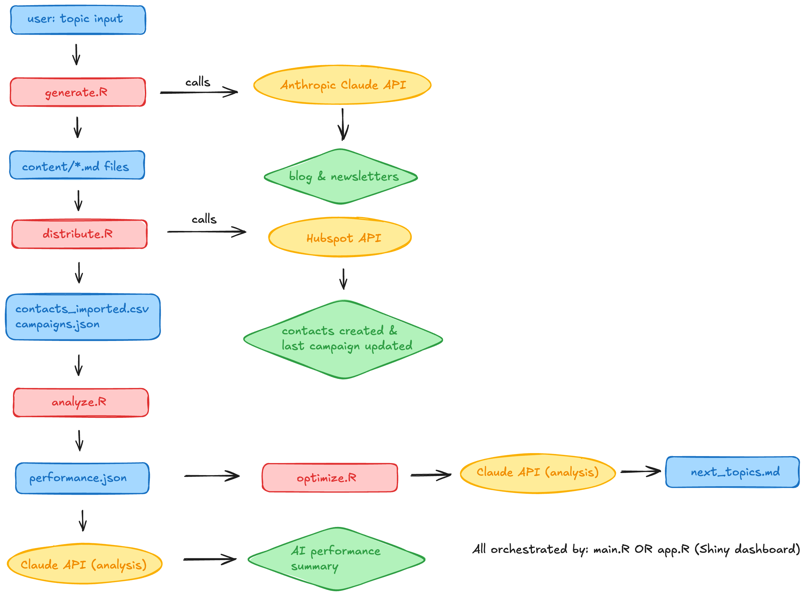

# NovaMind AI Marketing Content Pipeline

An R-based automation pipeline that generates, distributes, and optimizes marketing content using Claude (Anthropic) and the HubSpot CRM API.

Built as a take-home assignment for Palona AI's Content & Growth Analyst role.

---

## What it does

Given a single blog topic as input, the pipeline:

1. **Generates** a 400–600 word blog post plus three persona-specific newsletter versions using Claude.
2. **Segments** 15 mock contacts in HubSpot by persona (creative director, freelance designer, agency owner) and logs each campaign send directly to each contact's CRM record.
3. **Simulates** realistic engagement metrics (open/click/unsub rates) per persona and stores them for historical comparison.
4. **Analyzes** performance with a Claude-generated analyst summary and recommends next blog topics based on engagement trends.

All of this runs either as a single command-line call (`Rscript main.R "topic"`) or through an interactive Shiny dashboard (`shiny::runApp()`).

---

## Architecture



---

## Tech stack

| Layer | Tool |
|---|---|
| Language | R 4.5 |
| LLM | Anthropic Claude (`claude-sonnet-4-5`) via the `ellmer` R package |
| CRM | HubSpot free developer tier (Private App + Contacts API) |
| HTTP | `httr2` for API calls |
| Data | `dplyr`, `jsonlite`, `readr` |
| UI | `shiny` + `shinythemes` (flatly), `ggplot2` for charts |
| Reproducibility | `renv` lockfile |

---

## Personas

Three target personas were defined to match NovaMind's audience (small creative agencies):

- **Creative Director** — values team output quality and creative vision. Receives strategic, inspiring content.
- **Freelance Designer** — values time savings on admin work. Receives casual, practical content.
- **Agency Owner** — values ROI and scaling without headcount. Receives metrics-driven, business-focused content.

---

## Assumptions and simulations

This is a prototype; a few things are intentionally mocked:

- **Contacts are synthetic** (`contacts.csv`) with `@example.com` emails, not real leads.
- **Newsletter sends are simulated.** HubSpot's free developer tier restricts marketing email sends via API, so each "send" is logged directly to the recipient's CRM record via a custom `last_campaign` property, and the full send history is also persisted to `campaigns.json`.
- **Engagement metrics are simulated** by `analyze.R` with realistic per-persona base rates and Gaussian noise. In production, these would come from HubSpot's email analytics API.
- **"Already exists" API responses (HTTP 409) are expected** when re-running `import_contacts()` on existing contacts; the pipeline is idempotent and skips duplicates.

---

## Project structure

```
novamind-pipeline/
├── generate.R            # Phase 1: AI content generation
├── distribute.R          # Phase 2: HubSpot sync + campaign logging
├── analyze.R             # Phase 3: performance simulation + AI summary
├── optimize.R            # Bonus: AI-driven next-topic suggestions
├── main.R                # Orchestration entry point
├── app.R                 # Shiny dashboard UI
├── contacts.csv          # 15 mock contacts
├── contacts_imported.csv # Contacts with HubSpot IDs after sync
├── campaigns.json        # Full campaign send history
├── performance.json      # Simulated engagement metrics
├── next_topics.md        # Latest AI topic recommendations
├── content/              # Generated blog + newsletter markdown
├── architecture.png      # System diagram
├── .env                  # API keys (gitignored)
└── renv.lock             # Reproducible package versions
```

## How to run locally

### 1. Prerequisites

- R 4.2+ and RStudio Desktop
- An Anthropic API key (console.anthropic.com)
- A HubSpot free developer account with a Private App token

### 2. Clone and set up

```bash
git clone https://github.com/vidyapandiaraju22/novamind-pipeline.git
cd novamind-pipeline
```

Open `novamind-pipeline.Rproj` in RStudio.

### 3. Restore packages

In the R console:

```r
renv::restore()
```

### 4. Add your API keys

Create a file called `.env` in the project root:

```
ANTHROPIC_API_KEY=sk-ant-...
HUBSPOT_TOKEN=pat-na1-...
```

### 5. Add the HubSpot custom properties

In the HubSpot UI (Settings → Data Management → Properties → Create property):

- Create `persona` (single-line text)
- Create `last_campaign` (single-line text)

### 6. Run it

**Command line:**

```r
source("main.R")
run_full_pipeline("AI in creative automation")
```

**Shiny dashboard:**

```r
shiny::runApp()
```

Opens at `http://127.0.0.1:<port>` with:

- Input for topic
- Generated blog + 3 persona newsletters (rendered markdown)
- Performance chart (open/click rate by persona) and AI summary
- AI-recommended next topics with A/B headline variants

---

## Bonus features implemented

- ✅ AI-driven content optimization — `optimize.R` reads historical performance and suggests 5 next blog topics with A/B headline variants.
- ✅ Multiple options for copy — each topic suggestion comes with 3 alternative headline variants.
- ✅ Interactive dashboard — full Shiny UI with tabs for blog, newsletters, performance, and next topics.

---

## Sample output

A working end-to-end run is included in `content/` and `campaigns.json` so reviewers can inspect outputs without running the pipeline.